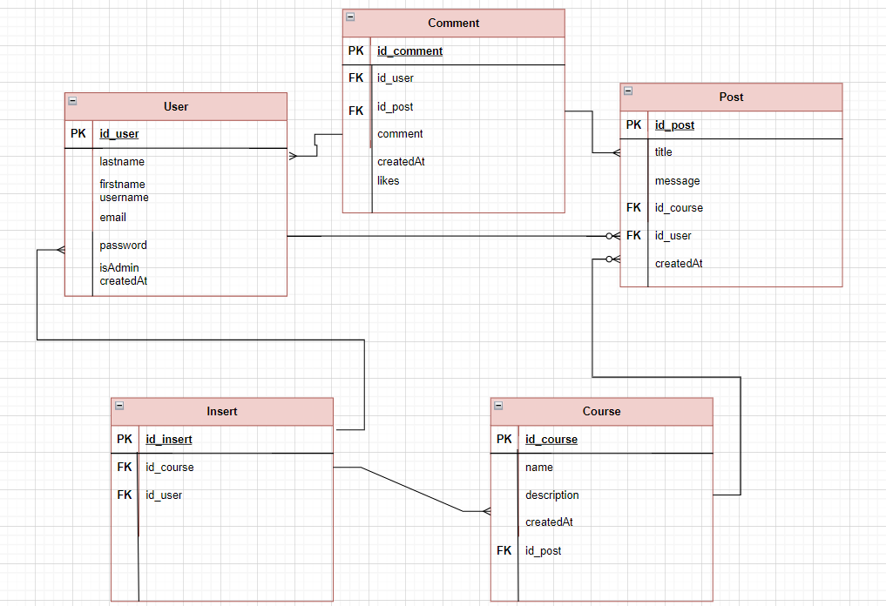

# Projet Application mobile
AppForum est une application mobile développée en Dart qui permet aux utilisateurs de participer à des forums de discussion. L'application utilise une API Node.js développée en JavaScript pour gérer les fonctionnalités backend.

## Langages
* Dart
* JavaScript

## Auteur
* nom de l'application : AppForum
* Thierry Joel Tchanteu : 17367

# Fonctionnalités de l'application
* Gestion du profil : les utilisateurs peuvent créer,mettre à jour et supprimer leur profil.
* Gestion des cours : les administrateurs peuvent créer, mettre à jour et supprimer un cours.
* Gestion des posts : les utilisateurs peuvent créer, mettre à jour et supprimer leurs posts pour des cours.
* Gestion des commentaires: les utilisateurs peuvent créer, mettre à jour ou supprimer leurs commentaires pour un post.

## modèle relationnel

# Installation et configuration du projet
* Télecharger ou cloner le dossier appForum de github en tapant : git clone https://github.com/thierry237/mobileApp.git
* Télecharger ou cloner le dossier appForum (Backend) de github en tapant : git clone https://github.com/thierry237/AppForum.git
* Assurez-vous d'avoir Dart et Flutter installés sur votre machine. Vous pouvez les télécharger et les installer à partir du site officiel de Flutter https://docs.flutter.dev/get-started/install
##
* Accéder au repertoire du projet appForum(backend) et installer les dependances en éxecutant la commande *npm install*
    1. Démarrez le serveur API en éxecutant la commande node server.js

* Accèder au repertoire du projet en dart et installer les dépendances en éxecutant la commande *flutter pub get*
    1. Lancez l'application sur votre émulateur ou votre appareil connecté : flutter run
